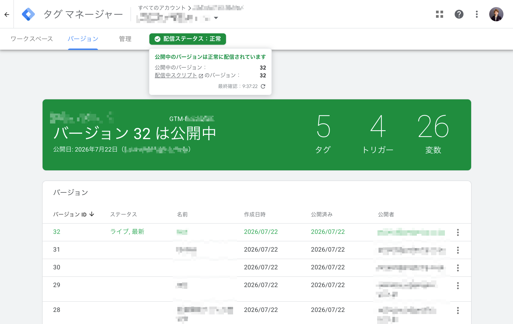
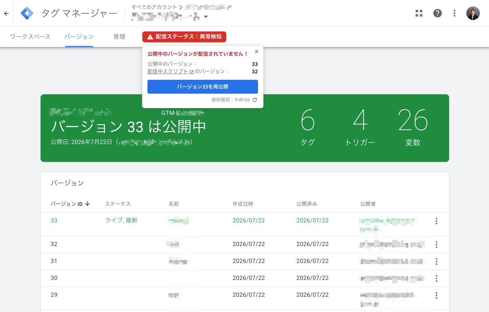

# GTM Version Checker

| 🟢 正常時 | 🔴 異常検知時 |
| --- | --- |
|  |  |

## インストール

Chromeウェブストアから、お使いのブラウザに追加できます。

**▶ [Chromeウェブストアで「GTM Version Checker」をインストールする](https://chromewebstore.google.com/detail/gtm-version-checker/jkoemgbiahlblliohkojibolepahaiko)**

---

**Google タグ マネージャー（GTM）で「公開」した内容が、実際に配信されているかを自動でチェックする Chrome 拡張機能です。**

GTMコンテナの管理画面で、ヘッダーに「配信ステータス」が表示されます。

- 🟢 **緑のチェック** … 公開中のバージョンが正しく配信されています
- 🔴 **赤の警告** … 公開したはずのバージョンが配信されていません（古いバージョンが配信されている、または未配信）

異常を検知した場合は、アラート内の **「再公開」ボタンをワンクリックするだけで復旧** できます。

## 背景：GTMの「公開したのに反映されない」不具合

この拡張機能を作ったきっかけは、GTM側で実際に発生した次の不具合です。

- **事象**：GTMで変更を加えて「公開」しても、その内容がサイトに反映されない。配信用スクリプト（gtm.js）が、なぜか古いバージョンの内容を返し続ける。
- **推定要因**：バージョン公開時に、配信用スクリプトの生成・更新が失敗するGTM内部の一時的なエラーと見られます。
- **解消方法**：最新バージョンを **何も変更せずにもう一度「公開」し直す**（再公開する）ことで、配信用スクリプトに内容が反映されます。

⚠️ この不具合は現時点では解消しているようですが、**まだ動作が不安定なケースも確認されています**。また、不具合の発生期間中に公開した内容は、**再公開しない限りサイトに反映されません**。GTMで公開した変更が実際にサイトへ反映されているか確認するとともに、今後もし再発した場合に備えて、いち早く異常を検知できる体制を整えておくことが重要です。この拡張機能は、そのための仕組みを提供します。

なお、本不具合について、現時点で Google 社からの公式な障害報告は発表されていません。上記の要因・解消方法は、あくまで弊社（PROJECT GROUP株式会社）の調査に基づく推定である点にご留意ください。

## なぜこの拡張機能が便利か

GTMの管理画面は「公開済み」と表示するだけで、**その内容が本当に配信されているかまでは教えてくれません**。上記の不具合が起きていても、管理画面上は正常に見えてしまいます。

手動で確認しようとすると、gtm.jsのソースコードを開いてバージョン番号を目視で探し、管理画面の公開バージョンと突き合わせる…という手間のかかる作業になります。

この拡張機能を入れておけば：

- **自動でチェック**：管理画面を開くだけで、公開バージョンと配信中スクリプトのバージョンを自動照合します。設定は一切不要です。
- **ズレたらすぐ分かる**：不一致を検知すると赤い警告アイコンとツールチップでお知らせします。
- **ワンクリックで復旧**：「再公開」ボタンを押すだけで、配信スクリプトに最新バージョンを反映し直せます。
- **公開作業の見届けにも**：バージョンを公開すると自動で再チェックが走り、配信への反映が完了したことを緑のチェックで確認できます。

## 画面の見方

「バージョン」タブの横に表示されるアイコンが、現在の配信ステータスを表します。

| アイコン | 状態 | 意味 |
| --- | --- | --- |
| 🟢 緑のチェック | 正常 | 公開中バージョンと配信中スクリプトが一致 |
| 🔴 赤の警告 | 異常検知 | バージョンの不一致、またはgtm.jsが未配信（404） |
| ⏳ グレーのスピナー | 検証中 | 初回チェック中、または不一致検知後の再確認中 |
| （非表示） | 対象外 | ウェブ用以外のコンテナ（サーバー / モバイル / AMP 等） |

アイコンや「バージョン」タブにマウスを乗せると、ツールチップで詳細を確認できます。

- **公開中のバージョン**：GTM管理画面上で最後に公開されたバージョン番号
- **配信中スクリプトのバージョン**：実際に配信されているgtm.jsに記載されたバージョン番号（クリックでgtm.jsを別タブで開けます）
- **最終確認時刻と再確認ボタン**：クリックするといつでも手動で再チェックできます

異常検知時には、ツールチップ内に **「バージョン N を再公開」ボタン** が表示されます。クリックすると現在の公開バージョンを再公開し、配信スクリプトへの反映を試みます。

## 仕組み — OAuth 連携が不要な理由

この拡張機能は、**GTMの管理画面にログインしているあなたのブラウザの中だけ** で動作します。外部サーバーとの通信や、Google アカウントとのAPI連携（OAuth）は一切ありません。

1. **公開中バージョンの取得**：GTM管理画面と同じサイト内（同一オリジン）のAPIから、ログイン済みの状態のままコンテナ情報を取得します。管理画面自身が画面表示に使っているのと同じ経路です。
2. **配信中バージョンの取得**：配信用スクリプト（gtm.js）を、キャッシュを回避して直接取得し、記載されているバージョン番号を読み取ります。
3. **照合と表示**：両者を比較し、結果をアイコンとツールチップで表示します。
4. **再公開**：GTM管理画面の「公開」ボタンが内部で呼んでいるのと同じAPIを、同一オリジン・Cookie認証・XSRFトークン（Cookieから取得）で呼び出します。つまり、**あなた自身が管理画面で「公開」ボタンを押すのと全く同じ操作** をワンクリックで代行しているだけです。

このように「ログイン済みのブラウザからしか操作できない」設計のため、OAuth連携・APIキー・パスワードの入力は不要です。あなたに公開権限がないコンテナでは、管理画面での操作と同様に再公開もエラーになります（権限を超えた操作はできません）。

### プライバシー・安全性

- `manifest.json` で要求する権限（`permissions` / `host_permissions`）は **ゼロ** です
- 動作するのは `tagmanager.google.com` のページ上のみです
- データの外部送信・保存は一切行いません

## 既知の制約

- **公開直後の一時的な不一致**：CDN キャッシュの影響で、公開から数分間は古いバージョンが配信され、一時的に「不一致」となる場合があります。誤検知を減らすため、不一致を検知しても即座には警告を出さず、2 秒後の再確認で確定してから表示します。また公開直後は、配信が追いつくまで自動でリトライ（10 秒間隔・最大 3 分）します。
- **非公開の内部APIに依存**：コンテナ情報の取得と再公開にはGTM管理画面の内部APIを利用しています。仕様が変更されると動作しなくなる可能性がありますが、その場合は「取得失敗」を表示して安全に停止します。
- **公開権限の事前判定は不可**：内部APIに「現在のユーザーが公開できるか」を事前に知る手段がないため、再公開ボタンは常に表示されます。権限がない場合は、押した時点で「権限がありません。」というエラーがツールチップ内に表示されます。

## 開発者向け：実装メモ

<details>
<summary>クリックで展開</summary>

- **表示条件の厳密化（フラッシュ防止）**：URL が `accounts/{id}/containers/{id}` を含むだけでなく、SPA の画面遷移が完了しコンテナ詳細の本体 UI（`shrouter-view.gtm-ng-view` 配下）が描画済みであることを確認してからアイコンを表示します。トップナビは本体より先に切り替わるため、URL やタブの有無だけを条件にすると一覧→詳細の遷移中に一瞬誤表示が発生します。
- **gtm.jsの取得**：googletagmanager.com は CORS を許可しているため通常の `fetch` で取得できます。`?t=<timestamp>` の付与と `cache: 'no-store'` でキャッシュを回避します。
- **404（未配信）の検出**：googletagmanager.com は 404 レスポンスに CORS ヘッダを付けないため、`fetch` は `TypeError` で reject されます。これを「未配信」の異常として分類します。200 だがバージョン記述がない場合はgtm.js非対象コンテナとみなしスキップします。
- **公開検知**：`publishedContainerVersionId` を 20 秒間隔でポーリングしつつ、公開直後の URL 遷移（`.../versions/{N}`）も検知して即時チェックします。
- **再公開APIのエラー判定**：内部の publishAPIは失敗時も HTTP 200 を返し、本文の `errorCode` / `errorMessage` で結果を表します。`errorCode` が非 0 なら失敗と判定し（例：`7` = 権限なし）、メッセージをツールチップに表示します。成功時のみページをリロードします。

</details>

## ファイル構成

```
gtm-version-checker/
├── manifest.json   # MV3・要求権限なし・content_scriptsのみ
├── content.js      # URL監視・API取得・バージョン照合・公開検知・UI描画
├── content.css     # アイコン / ツールチップのスタイル
└── icon.png        # 拡張機能アイコン
```

## コントリビュート

バグ報告・機能要望は [Issues](../../issues) へお気軽にどうぞ。Pull Requestも歓迎です。

## 免責事項

本拡張機能はPROJECT GROUP株式会社が開発した非公式ツールであり、Google社およびGoogleタグマネージャーとは一切関係ありません。GTM管理画面の内部APIを利用しているため、GTM側の仕様変更により予告なく動作しなくなる可能性があります。

## ライセンス

[MIT License](LICENSE)
